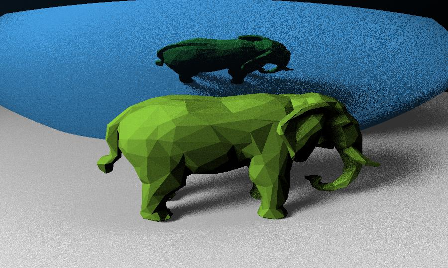
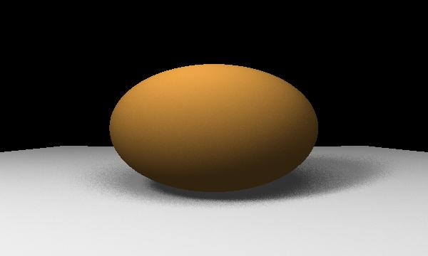
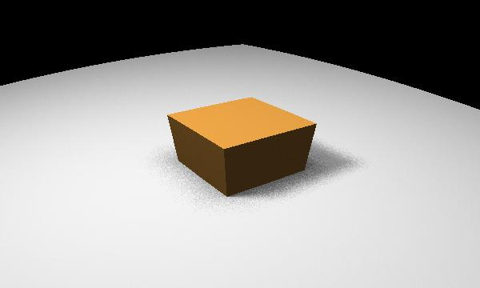
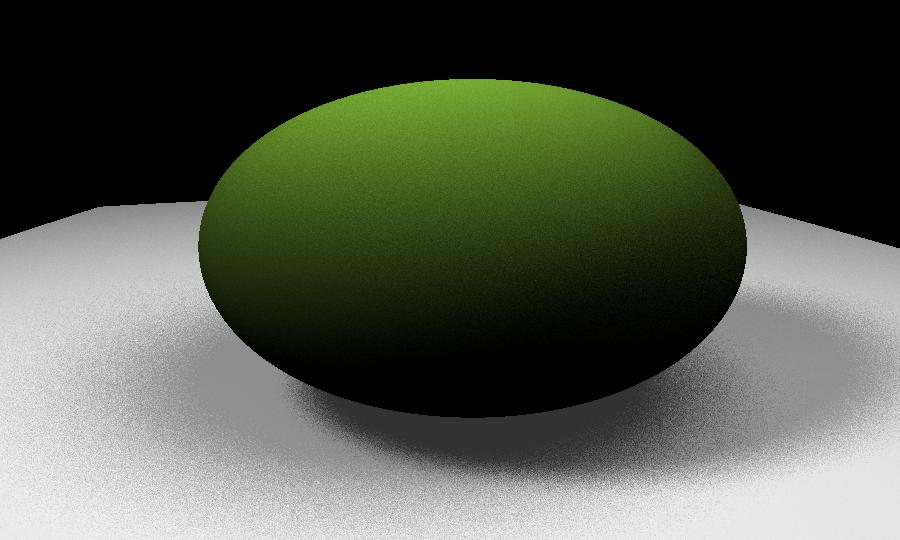
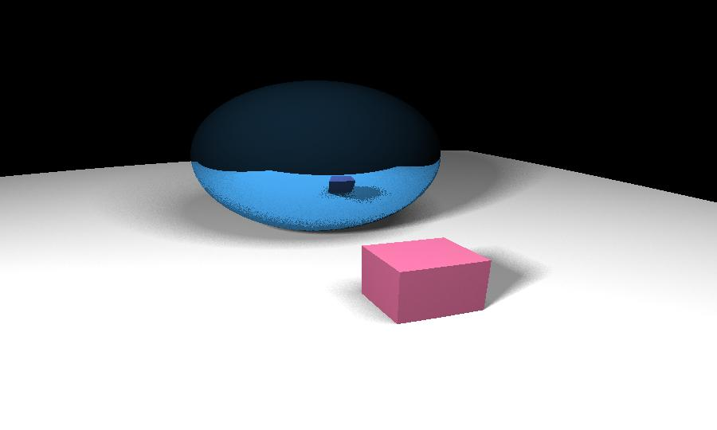
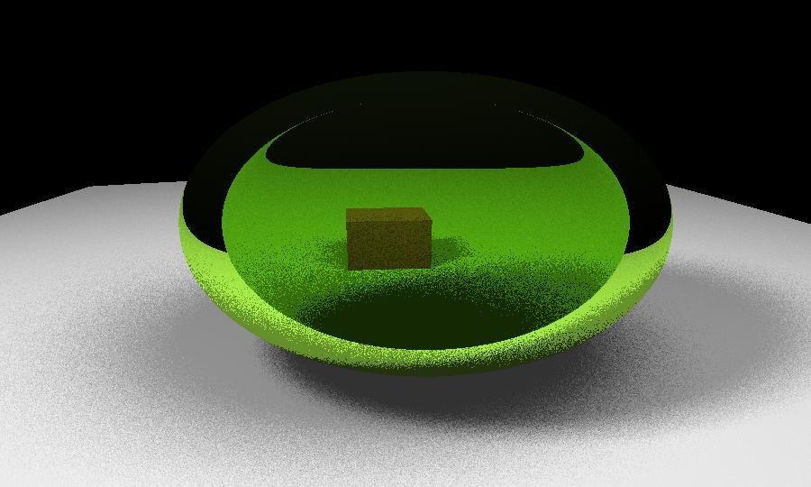
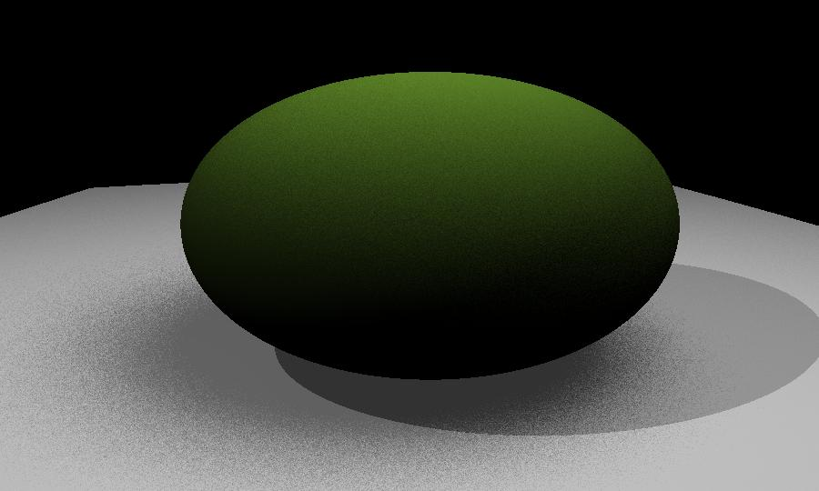

Python Raytracer
================

This repository is a python based raytracing renderer, that is able to transform 
geometric shapes / polygons into pictures like this one:

Setup
-----
I'm using poetry to set up the environment.

simply run 

    peotry install 

to set up all the dependencies.
Then you can start using it. 

How to use
----------

The basic procedure is, first you set up your scene with geometric objects and light sources. 
Then you set up the screen that observes the screen. Then you render it.

Let's go through the different parts step by step.

Geometry
--------

Geometry is everything that makes your scene. For Example you could set up a sphere like this:
There are two basic kinds of elements that can set up a scene. A Sphere or a polygon. 

    from ray_tracer.engine.core import Sphere
    my_spere = Sphere(Vector.from_list([0,0,0]), radius=50, surface=my_surface)

Ignore the surface for a second, we'll cover that in second, but this will set up a sphere centered at the vector 
[0,0,0] with the radius 50. A polygon can be set up in a similar way. 
    
    from ray_tracer.engine.core import Polygon
    polygon = Polygon(
        Vector.from_list([0, 0, 100]), 
        Vector.from_list([100, 0, 0]), 
        Vector.from_list([0, 100, 0]), 
        surface=polygon_surface)
    
A Geometry is then a combination of multiple of these objects.

    geometry = Geometry(my_sphere, polygon, ...)

There are also premade geometries like a cube:

    from ray_tracer.engine.core import Cube
    cube = Cube.from_center(Vector.from_list([0, 0, 599]), width=1200, surface=cube_surface)

Or if you want to render something more complicated, you can also directly load all the polygons from an stl file:

    rabbit = stl_to_polys(Vector.from_list([0, 0, 200]), Path(__file__).parent / "resources" / "rabbit.stl",
                      surface=green_surface)

Geometries can be combined by simply using the **+** operator.

    scene = my_spere + cube + polygon

Next, let's find out what these mysterious surfaces are I skipped over earlier. 

Surfaces
--------

We don't want all objects to look the same. In order to properly make the scene look as we want it to, 
we can define it's surface. This looks as follows:

    my_surface = Surface(k_ambient=50, k_diffuse=1, k_reflect=0, k_refraction=0, color=Vector.from_list([1, 1, 1]))

each parameter controls a different property of the surface. 

### k_ambient
Ambient lighting. This makes the surface glow, meaning it will light up without needing a light source. 

### k_diffuse
Diffuse reflection. This controls how much light bounces of in random directions. Effectively, 
this means how much light from a light source that is not angled to reflect directly into the screen still bounces of in
the direction of the screen. If a surface only has k_diffuse switched on, it will appear as a "normal" smooth surface.

### k_reflect
This defines how much of the light is reflected. This will allow you to see reflections on the surface as you would 
in a mirror. 

### k_refract
This defines how much of the light can pass through the surface. This will make the surface see through and glassy. 
For refraction, there are 2 parameters controlling the behaviour of the surface. k_refract controls the proportion of
the light passing through the surface, while refraction_strength is the refraction index of the surface. 1 will behave like air,
1.3 like water, 1.5 like glass. 

### color
Finally the color is exactly what it says. It is represented as an rgb vector that is normalized to 1. 
Vector.from_list(1, 0, 0) will be a red object, Vector(1,1,1) will be white. 

Light Sources
-------------

The light sources illuminate your scene. There are 2 kinds of light sources currently imeplemented. 
A point light source and a spherical light source. 

    from ray_tracer.engine.light import LightSource, SphericalLightSource
    point_light = LightSource(pos=Vector.from_list([0,0,0]), strength=1)
    sphere_light = SphericalLightSource(strength=200, pos=Vector.from_list([-100, 0, 300]), radius=10, surface=None)

The difference between the two is that with a point light source the shadows will always be very smooth and sharp, while 
for a spherical light source, we'll do the calculation multiple times for different points on the surface of the sphere
Which will make the shadows smoother. In the picture below, the shadow to the left comes from a spherical light source and the one
to the right from a point light source.

Screen
------

The screen is the thing observing the scene we created. It consists of a grid of pixels with a direction they observe. 
After rendering, each pixel will obtain an rgb value that can be shown as a picture. 

    screen = Screen(res_x=600, res_y=100, fov=90, scale=1)

res_x and res_y is the resolution in x and y direction. Fov (field of view) is the angle which the screen will cover.
and scale will allow you to make the screen itself smaller or bigger. 2 means the screen is twice the size and 0.5 means 
it's half as big. 

Rendering a scene 
-----------------

The final step is actually rendering the scene. 
    
    from ray_tracer.engine.core import Tracer
    tracer = Tracer(world=world, light_sources=light_sources, screen=screen)
    pixels = tracer.run_parallel_batched(iterations=3, light_iterations=5)

the only new parameters that are new is the iterations and light_iterations parameter.
"iterations" controls the number of times we allow the light to bounce off of reflective and refractive surfaces. 
"light_iterations" is the number of points we sample from the surface of spherical light sources to generate smooth 
shadows. 

And that's it, we obtained a grid of pixels that we can convert into an image. for example using the Pillow library.

    data = np.array(pixels, dtype=np.uint8)
    image = Image.fromarray(data)
    image.show()
    image.save("generated_images/" + "rabbit_" + str(time.time()) + ".jpg", "JPEG")

